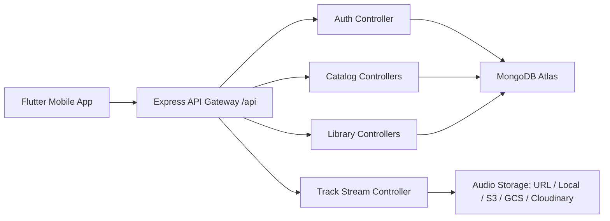
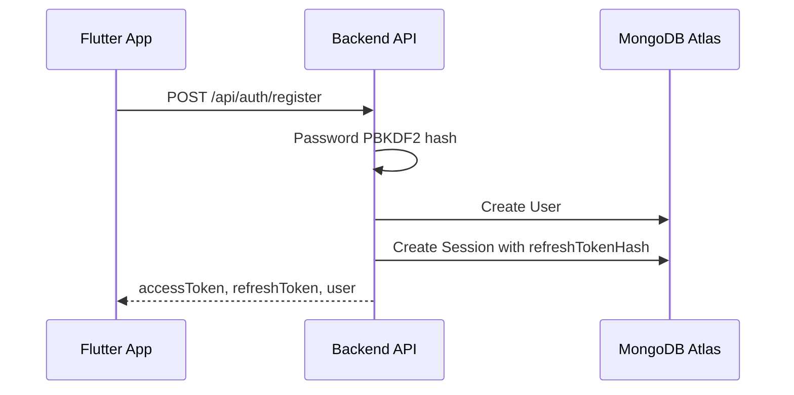

# Audio Streaming App Backend Documentation Report

## 1. Төслийн зорилго

Энэхүү backend нь Flutter дээр хийгдэх audio streaming application-д зориулсан REST API service юм. Backend-ийн үндсэн зорилго нь хэрэглэгчийн бүртгэл, нэвтрэлт, artist/album/track metadata, playlist, library, like/follow, play history болон audio streaming endpoint-үүдийг нэг API gateway дор зохион байгуулах юм.

Энэ хувилбар нь MVP түвшний backend skeleton боловч цаашид production орчин руу өргөтгөхөд тохиромжтой module бүтэцтэй.

## 2. Ашигласан технологи

| Технологи | Үүрэг |
| --- | --- |
| Node.js | Backend runtime |
| Express.js | REST API server болон route management |
| MongoDB Atlas | Cloud database |
| Mongoose | MongoDB schema/model layer |
| dotenv | Environment variable унших |
| cors | Flutter/mobile client-ээс API дуудах CORS тохиргоо |
| Node crypto | Password hash, JWT sign/verify, refresh token hash |

Package script-үүд:

```bash
npm start
npm run dev
npm run check
```

## 3. Системийн ерөнхий архитектур



Backend нь metadata болон activity өгөгдлийг MongoDB Atlas дээр хадгална. Харин audio файлыг MongoDB-д шууд хадгалахгүй. Production орчинд audio файлыг S3, Google Cloud Storage, Cloudinary зэрэг object storage дээр байршуулж, MongoDB дээр зөвхөн URL эсвэл storage key хадгална.

## 4. Folder бүтэц

```text
src/
  config/
    db.js
  controllers/
    albumController.js
    artistController.js
    authController.js
    libraryController.js
    playlistController.js
    searchController.js
    trackController.js
    userController.js
  middleware/
    asyncHandler.js
    auth.js
    errorHandler.js
  models/
    Album.js
    Artist.js
    Follow.js
    Like.js
    PlayHistory.js
    Playlist.js
    Session.js
    Track.js
    User.js
  routes/
    albumRoutes.js
    artistRoutes.js
    authRoutes.js
    index.js
    libraryRoutes.js
    playlistRoutes.js
    searchRoutes.js
    trackRoutes.js
    userRoutes.js
  utils/
    pagination.js
    password.js
    token.js
  server.js
```

Үүргийн тайлбар:

| Folder | Тайлбар |
| --- | --- |
| `config` | Database connection зэрэг тохиргоо |
| `controllers` | Request боловсруулах business logic |
| `middleware` | Auth, error handling, async wrapper |
| `models` | Mongoose schema болон collection definitions |
| `routes` | API gateway endpoint mapping |
| `utils` | Давтагдах helper function-ууд |

## 5. Environment тохиргоо

`.env` файлд дараах утгууд байна:

```env
PORT=5050
MONGODB_URI=mongodb+srv://<username>:<password>@<cluster-url>/?appName=Cluster0
MONGODB_DB_NAME=streaming_app
JWT_ACCESS_SECRET=<long-random-secret>
JWT_REFRESH_SECRET=<another-long-random-secret>
ACCESS_TOKEN_EXPIRES_IN=15m
REFRESH_TOKEN_EXPIRES_IN=30d
```

Анхаарах зүйл:

- `.env` файлыг Git-д commit хийхгүй.
- `JWT_ACCESS_SECRET` болон `JWT_REFRESH_SECRET` production дээр урт, санамсаргүй, тусдаа утга байх ёстой.
- Local machine дээр `5000` порт AirTunes service-тэй давхцах боломжтой тул `5050` ашиглах нь илүү найдвартай.

## 6. Database connection

MongoDB Atlas connection нь `src/config/db.js` дотор байна.

```js
await mongoose.connect(uri, {
  dbName: process.env.MONGODB_DB_NAME || undefined,
});
```

Хэрэв `MONGODB_URI` байхгүй бол server эхлэхгүй. Энэ нь production дээр буруу config-тэй service асаахаас хамгаална.

## 7. Authentication ба Authorization

Backend нь access token + refresh token flow ашиглана.

### 7.1 Register flow



### 7.2 Login flow

1. Flutter app email/password илгээнэ.
2. Backend email-ээр user хайна.
3. Password hash шалгана.
4. Access token болон refresh token үүсгэнэ.
5. Refresh token-ийг plain text-ээр DB-д хадгалахгүй, SHA-256 hash болгон `Session` collection-д хадгална.

### 7.3 Access token

Access token нь short-lived token.

Default:

```env
ACCESS_TOKEN_EXPIRES_IN=15m
```

Protected API дуудахдаа:

```http
Authorization: Bearer <accessToken>
```

### 7.4 Refresh token

Refresh token нь long-lived token.

Default:

```env
REFRESH_TOKEN_EXPIRES_IN=30d
```

Access token expired болсон үед Flutter app дараах endpoint-ийг дуудна:

```http
POST /api/auth/refresh
Content-Type: application/json

{
  "refreshToken": "...",
  "deviceId": "optional-device-id"
}
```

Refresh хийх үед backend refresh token rotation хийдэг. Өөрөөр хэлбэл хуучин refresh token-ийг шинэ refresh token-оор сольж, `Session.refreshTokenHash` шинэчлэгдэнэ.

### 7.5 Logout

Logout хийхэд session-ийн `revokedAt` field шинэчлэгдэнэ.

```http
POST /api/auth/logout
Content-Type: application/json

{
  "refreshToken": "..."
}
```

### 7.6 Role-based authorization

User role:

| Role | Эрх |
| --- | --- |
| `listener` | Сонсох, playlist үүсгэх, like/follow хийх |
| `artist` | Listener эрхээс гадна artist/album/track үүсгэх |
| `admin` | Content management болон moderation-д зориулагдсан |

Одоогоор дараах endpoint-үүд `artist` эсвэл `admin` role шаарддаг:

- `POST /api/artists`
- `POST /api/albums`
- `POST /api/tracks`
- `PATCH /api/tracks/:id`

## 8. MongoDB Models

### 8.1 User

Collection: `users`

Зорилго: App хэрэглэгчийн үндсэн profile болон auth-д хэрэгтэй password hash хадгална.

Гол талбарууд:

| Field | Type | Тайлбар |
| --- | --- | --- |
| `displayName` | String | Хэрэглэгчийн харагдах нэр |
| `email` | String | Unique login email |
| `passwordHash` | String | PBKDF2 password hash |
| `avatarUrl` | String | Profile зураг |
| `role` | String | `listener`, `artist`, `admin` |
| `isActive` | Boolean | Account идэвхтэй эсэх |

Index:

- `email` unique
- `displayName`, `email` text search

### 8.2 Session

Collection: `sessions`

Зорилго: Refresh token session management.

Гол талбарууд:

| Field | Type | Тайлбар |
| --- | --- | --- |
| `user` | ObjectId | User reference |
| `refreshTokenHash` | String | Refresh token SHA-256 hash |
| `expiresAt` | Date | Session expiry |
| `revokedAt` | Date | Logout/revoke болсон огноо |
| `deviceId` | String | Flutter device identifier |
| `ipAddress` | String | Request IP |
| `userAgent` | String | Client user agent |

TTL index:

- `expiresAt` field дээр TTL index байгаа тул expired session автоматаар цэвэрлэгдэнэ.

### 8.3 Artist

Collection: `artists`

Зорилго: Artist profile, genre, social links, follower count хадгална.

Гол талбарууд:

| Field | Type | Тайлбар |
| --- | --- | --- |
| `name` | String | Artist name |
| `bio` | String | Artist description |
| `avatarUrl` | String | Profile image |
| `coverUrl` | String | Cover/banner image |
| `genres` | Array String | Artist genre list |
| `socials` | Object | Website, Instagram, YouTube гэх мэт |
| `verified` | Boolean | Verified artist эсэх |
| `ownerUser` | ObjectId | User reference |
| `followerCount` | Number | Дагагчийн тоо |

### 8.4 Album

Collection: `albums`

Зорилго: Album, single, EP metadata хадгална.

Гол талбарууд:

| Field | Type | Тайлбар |
| --- | --- | --- |
| `title` | String | Album title |
| `artist` | ObjectId | Artist reference |
| `type` | String | `album`, `single`, `ep`, `compilation` |
| `coverUrl` | String | Album cover |
| `releaseDate` | Date | Release date |
| `genres` | Array String | Genre list |
| `trackCount` | Number | Track тоо |
| `isPublished` | Boolean | Public эсэх |

### 8.5 Track

Collection: `tracks`

Зорилго: Audio track metadata болон streaming source хадгална.

Гол талбарууд:

| Field | Type | Тайлбар |
| --- | --- | --- |
| `title` | String | Track title |
| `artist` | ObjectId | Main artist |
| `album` | ObjectId | Album reference |
| `featuringArtists` | Array ObjectId | Featuring artists |
| `genres` | Array String | Genre list |
| `durationSec` | Number | Track duration |
| `trackNumber` | Number | Album доторх дугаар |
| `coverUrl` | String | Track cover |
| `audioUrl` | String | Stream хийх URL/path |
| `storageProvider` | String | `url`, `local`, `s3`, `gcs`, `cloudinary` |
| `storageKey` | String | Object storage key |
| `mimeType` | String | Жишээ: `audio/mpeg` |
| `explicit` | Boolean | Explicit content эсэх |
| `isPublished` | Boolean | Public эсэх |
| `playCount` | Number | Нийт play count |
| `likeCount` | Number | Нийт like count |

### 8.6 Playlist

Collection: `playlists`

Зорилго: User playlist болон playlist доторх track ordering хадгална.

Гол талбарууд:

| Field | Type | Тайлбар |
| --- | --- | --- |
| `name` | String | Playlist нэр |
| `description` | String | Тайлбар |
| `owner` | ObjectId | Playlist эзэмшигч |
| `coverUrl` | String | Playlist cover |
| `visibility` | String | `private`, `public`, `unlisted` |
| `tracks` | Array | Track reference, addedAt, position |
| `likeCount` | Number | Playlist like count |

### 8.7 Like

Collection: `likes`

Зорилго: User ямар track/album/playlist like хийснийг хадгална.

Unique index:

```text
user + targetType + targetId
```

Ингэснээр нэг user нэг track-ийг давхар like хийхгүй.

### 8.8 Follow

Collection: `follows`

Зорилго: User artist follow relationship хадгална.

Unique index:

```text
user + artist
```

### 8.9 PlayHistory

Collection: `playhistories`

Зорилго: Recently played, analytics, recommendation data-д ашиглах play event хадгална.

Гол талбарууд:

| Field | Type | Тайлбар |
| --- | --- | --- |
| `user` | ObjectId | Optional user reference |
| `track` | ObjectId | Track reference |
| `playedMs` | Number | Хэдэн ms сонссон |
| `completed` | Boolean | Дууг дуусгасан эсэх |
| `source` | String | `album`, `playlist`, `search`, `radio`, `direct` |
| `deviceId` | String | Device identifier |
| `ipAddress` | String | Request IP |

## 9. API Gateway дэлгэрэнгүй

Base URL:

```text
http://localhost:5050/api
```

### 9.1 Health

```http
GET /api/health
```

Response:

```json
{
  "status": "ok",
  "service": "streaming-app-backend",
  "timestamp": "2026-06-02T09:13:41.239Z"
}
```

### 9.2 Auth APIs

#### Register

```http
POST /api/auth/register
Content-Type: application/json
```

Request:

```json
{
  "displayName": "Muugii",
  "email": "muugii@example.com",
  "password": "testpass123",
  "role": "artist",
  "deviceId": "iphone-15"
}
```

Response:

```json
{
  "accessToken": "...",
  "refreshToken": "...",
  "sessionId": "...",
  "user": {
    "id": "...",
    "displayName": "Muugii",
    "email": "muugii@example.com",
    "role": "artist",
    "isActive": true
  }
}
```

#### Login

```http
POST /api/auth/login
Content-Type: application/json
```

Request:

```json
{
  "email": "muugii@example.com",
  "password": "testpass123",
  "deviceId": "iphone-15"
}
```

#### Refresh

```http
POST /api/auth/refresh
Content-Type: application/json
```

Request:

```json
{
  "refreshToken": "...",
  "deviceId": "iphone-15"
}
```

#### Logout

```http
POST /api/auth/logout
Content-Type: application/json
```

Request:

```json
{
  "refreshToken": "..."
}
```

### 9.3 User APIs

#### Get current user

```http
GET /api/users/me
Authorization: Bearer <accessToken>
```

### 9.4 Artist APIs

#### List artists

```http
GET /api/artists?q=search&genre=pop&page=1&limit=20
```

#### Create artist

```http
POST /api/artists
Authorization: Bearer <artist-or-admin-accessToken>
Content-Type: application/json
```

Request:

```json
{
  "name": "Test Artist",
  "bio": "Artist bio",
  "genres": ["pop", "rnb"],
  "avatarUrl": "https://example.com/avatar.jpg",
  "coverUrl": "https://example.com/cover.jpg"
}
```

#### Get artist detail

```http
GET /api/artists/:id
```

#### Artist albums

```http
GET /api/artists/:id/albums
```

#### Artist tracks

```http
GET /api/artists/:id/tracks
```

### 9.5 Album APIs

#### List albums

```http
GET /api/albums?q=search&artist=<artistId>&genre=pop&page=1&limit=20
```

#### Create album

```http
POST /api/albums
Authorization: Bearer <artist-or-admin-accessToken>
Content-Type: application/json
```

Request:

```json
{
  "title": "First Album",
  "artist": "<artistId>",
  "type": "album",
  "coverUrl": "https://example.com/cover.jpg",
  "releaseDate": "2026-06-02",
  "genres": ["pop"],
  "isPublished": true
}
```

### 9.6 Track APIs

#### List tracks

```http
GET /api/tracks?q=search&artist=<artistId>&album=<albumId>&genre=pop&sort=popular&page=1&limit=20
```

#### Create track

```http
POST /api/tracks
Authorization: Bearer <artist-or-admin-accessToken>
Content-Type: application/json
```

Request:

```json
{
  "title": "First Song",
  "artist": "<artistId>",
  "album": "<albumId>",
  "genres": ["pop"],
  "durationSec": 180,
  "trackNumber": 1,
  "coverUrl": "https://example.com/cover.jpg",
  "audioUrl": "https://example.com/audio/song.mp3",
  "storageProvider": "url",
  "mimeType": "audio/mpeg",
  "isPublished": true
}
```

#### Stream track

```http
GET /api/tracks/:id/stream
Range: bytes=0-
```

Behavior:

- `storageProvider !== "local"` бол backend `audioUrl` руу redirect хийнэ.
- `storageProvider === "local"` бол `public/` folder-оос Range request дэмжиж stream буцаана.
- Flutter audio player seek хийхэд Range request хэрэгтэй.

#### Record play

```http
POST /api/tracks/:id/play
Authorization: Bearer <optional-accessToken>
Content-Type: application/json
```

Request:

```json
{
  "playedMs": 45000,
  "completed": false,
  "source": "playlist",
  "deviceId": "iphone-15"
}
```

### 9.7 Playlist APIs

#### List public or my playlists

```http
GET /api/playlists?q=summer&page=1&limit=20
GET /api/playlists?mine=true
Authorization: Bearer <accessToken>
```

#### Create playlist

```http
POST /api/playlists
Authorization: Bearer <accessToken>
Content-Type: application/json
```

Request:

```json
{
  "name": "My Favorites",
  "description": "Songs I like",
  "visibility": "private"
}
```

#### Add track to playlist

```http
POST /api/playlists/:id/tracks
Authorization: Bearer <accessToken>
Content-Type: application/json
```

Request:

```json
{
  "trackId": "<trackId>"
}
```

#### Remove track from playlist

```http
DELETE /api/playlists/:id/tracks/:trackId
Authorization: Bearer <accessToken>
```

### 9.8 Library APIs

#### List likes

```http
GET /api/library/likes?targetType=track
Authorization: Bearer <accessToken>
```

#### Like target

```http
POST /api/library/likes
Authorization: Bearer <accessToken>
Content-Type: application/json
```

Request:

```json
{
  "targetType": "track",
  "targetId": "<trackId>"
}
```

#### Unlike target

```http
DELETE /api/library/likes/:targetType/:targetId
Authorization: Bearer <accessToken>
```

#### Play history

```http
GET /api/library/history
Authorization: Bearer <accessToken>
```

#### Followed artists

```http
GET /api/library/artists
Authorization: Bearer <accessToken>
```

#### Follow artist

```http
POST /api/library/artists
Authorization: Bearer <accessToken>
Content-Type: application/json
```

Request:

```json
{
  "artistId": "<artistId>"
}
```

### 9.9 Search API

```http
GET /api/search?q=keyword
```

Response:

```json
{
  "tracks": [],
  "artists": [],
  "albums": []
}
```

Search нь MongoDB text index ашиглана.

## 10. Error handling

Global error handler нь `src/middleware/errorHandler.js` дотор байна.

Алдааны төрлүүд:

| Error | HTTP status | Тайлбар |
| --- | --- | --- |
| Mongoose `CastError` | 404 | Invalid ObjectId эсвэл resource олдохгүй |
| Mongoose `ValidationError` | 400 | Schema validation failed |
| Duplicate key `11000` | 409 | Unique index зөрчсөн |
| Unknown error | 500 | Internal server error |

Жишээ:

```json
{
  "message": "Validation failed",
  "details": ["Path `title` is required."]
}
```

## 11. Pagination

Pagination helper нь `src/utils/pagination.js` дотор байна.

Query parameters:

```text
page=1
limit=20
```

Response format:

```json
{
  "data": [],
  "pagination": {
    "page": 1,
    "limit": 20,
    "total": 0,
    "totalPages": 0
  }
}
```

`limit` хамгийн ихдээ 100 байна.

## 12. Security considerations

Одоогийн хамгаалалт:

- Password plain text хадгалахгүй.
- Refresh token plain text хадгалахгүй.
- Access token short-lived.
- Refresh token rotation хийдэг.
- Logout хийхэд session revoke хийдэг.
- Role-based guard ашигласан.
- `.env` Git-д орохгүй.

Production-д нэмэх шаардлагатай зүйлс:

- HTTPS only deployment.
- Rate limiting, ялангуяа `/auth/login`.
- Request validation library, жишээ нь Zod/Joi.
- CORS origin whitelist.
- Admin-only role assignment.
- Email verification.
- Password reset flow.
- Audit logs.
- File upload validation and antivirus scan.

## 13. Flutter integration

Flutter app backend-тэй дараах байдлаар холбогдоно.

### Login дараах token хадгалалт

Use:

```text
flutter_secure_storage
```

Do not use:

```text
SharedPreferences
```

### Protected request header

```http
Authorization: Bearer <accessToken>
```

### Access token expired үед

Backend `401` болон `Access token expired` буцаавал:

1. Secure storage-оос refresh token уншина.
2. `POST /api/auth/refresh` дуудна.
3. Шинэ `accessToken`, `refreshToken` хадгална.
4. Анхны request-ээ дахин явуулна.

### Audio player

Flutter дээр `just_audio` зэрэг package ашиглахад stream URL:

```text
http://localhost:5050/api/tracks/:id/stream
```

Physical device дээр `localhost` нь утас өөрийгөө заадаг тул backend-ийн LAN IP ашиглана:

```text
http://192.168.x.x:5050/api/tracks/:id/stream
```

Android emulator дээр:

```text
http://10.0.2.2:5050/api
```

iOS simulator дээр:

```text
http://localhost:5050/api
```

## 14. Local testing guide

Server асаах:

```bash
PORT=5050 npm start
```

Health check:

```bash
curl http://localhost:5050/api/health
```

Register:

```bash
curl -X POST http://localhost:5050/api/auth/register \
  -H "Content-Type: application/json" \
  -d '{"displayName":"Muugii","email":"muugii@example.com","password":"testpass123","role":"artist"}'
```

Login:

```bash
curl -X POST http://localhost:5050/api/auth/login \
  -H "Content-Type: application/json" \
  -d '{"email":"muugii@example.com","password":"testpass123"}'
```

Current user:

```bash
curl http://localhost:5050/api/users/me \
  -H "Authorization: Bearer <accessToken>"
```

Create artist:

```bash
curl -X POST http://localhost:5050/api/artists \
  -H "Authorization: Bearer <accessToken>" \
  -H "Content-Type: application/json" \
  -d '{"name":"Test Artist","genres":["pop"],"verified":true}'
```

List tracks:

```bash
curl "http://localhost:5050/api/tracks?limit=10"
```

Syntax check:

```bash
npm run check
find src -name '*.js' -print0 | xargs -0 -n1 node --check
```

## 15. Одоогийн хязгаарлалт

Энэ backend MVP түвшинд дараах зүйлсийг хараахан бүрэн шийдээгүй:

- Audio file upload endpoint бүрэн хийгдээгүй.
- Artist ownership validation бүрэн хийгдээгүй. Жишээ нь artist user зөвхөн өөрийн artist-ийн track засах ёстой.
- Admin dashboard endpoint байхгүй.
- Payment/subscription model байхгүй.
- Recommendation algorithm байхгүй.
- Unit/integration test framework тохируулаагүй.
- Request body validation middleware байхгүй.
- Email verification болон password reset байхгүй.

## 16. Дараагийн хөгжүүлэлтийн санал

1. Request validation нэмэх.
2. Audio upload flow хийх.
3. Artist ownership guard хийх.
4. Admin moderation APIs нэмэх.
5. Automated tests нэмэх.
6. Cloud object storage integration хийх.
7. CI/CD pipeline тохируулах.
8. Swagger/OpenAPI documentation үүсгэх.

## 17. Дүгнэлт

Энэ backend нь audio streaming Flutter application-ийн үндсэн үйлдлүүдийг дэмжих MongoDB Atlas-based REST API юм. Authentication, catalog browsing, track streaming, playlist, library, like/follow, play history зэрэг app-ийн гол domain-уудыг тусдаа model, controller, route бүтэцтэйгээр зохион байгуулсан.

Одоогийн implementation нь MVP app хөгжүүлж эхлэхэд хангалттай бөгөөд дараагийн шатанд upload, ownership authorization, validation, automated testing, production security hardening нэмснээр production-ready service болгон өргөтгөх боломжтой.
