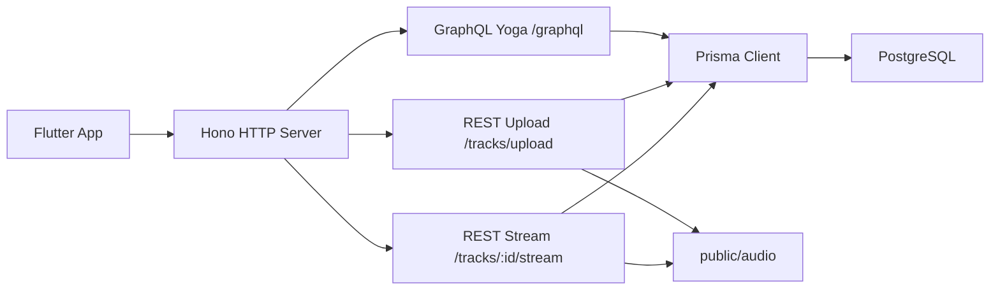

# Backend Report

## Overview

The backend has been rewritten for PostgreSQL using Hono, Prisma, and GraphQL Yoga.

Primary responsibilities:

- User authentication with access and refresh tokens
- Artist, album, track, genre, playlist, like, follow, and play history data
- GraphQL API for structured app operations
- REST audio upload and Range streaming

## Architecture



## Database

The PostgreSQL design is documented in [POSTGRES_ERD.md](./POSTGRES_ERD.md).

Important design decisions:

- UUID primary keys
- Composite primary keys for many-to-many join tables
- `playlist_tracks.id` as its own primary key so the same track can appear multiple times in one playlist
- `tracks.duration_ms` and `play_history.played_ms` both use milliseconds
- Separate like tables for tracks, albums, and playlists to preserve proper foreign keys

## Runtime Stack

- Hono for HTTP routing
- GraphQL Yoga for GraphQL
- Prisma 7 with `@prisma/adapter-pg`
- PostgreSQL via `DATABASE_URL`
- Node `crypto` for password hashing and JWT signing

## Source Structure

```text
src/
  app.ts
  server.ts
  prisma/client.ts
  graphql/typeDefs.ts
  graphql/schema.ts
  graphql/context.ts
  graphql/resolvers/
  modules/auth/
  modules/audio/
  modules/genre/
```

The entrypoint is intentionally small. `server.ts` starts the server, `app.ts` wires routes and GraphQL, and domain logic is separated under `modules/`.

## Audio Flow

Audio upload and streaming are REST routes because binary multipart upload and HTTP Range streaming are better handled outside GraphQL.

Upload:

```http
POST /tracks/upload
```

Stream:

```http
GET /tracks/:id/stream
Range: bytes=0-
```

Local files are stored under:

```text
public/audio
```

External files can be represented as tracks with `storageProvider = url`, in which case the stream route redirects to `audioUrl`.

## Setup

```bash
npm install
npm run prisma:generate
npm run prisma:migrate
npm run dev
```

See [HONO_PRISMA_GRAPHQL.md](./HONO_PRISMA_GRAPHQL.md) for API examples.
